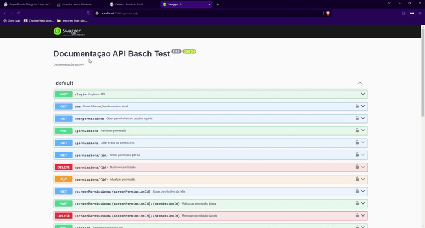

# Basch Test API

Esta é uma API de exemplo para demonstrar como criar uma aplicação Node.js com Swagger para documentação de APIs.

## Instalação

1. Certifique-se de ter o Node.js instalado em sua máquina. Você pode baixá-lo em [nodejs.org](https://nodejs.org/).
2. **Crie um banco de dados PostgreSQL** conforme necessário para a aplicação.
3. Clone este repositório para o seu ambiente local.
4. No diretório raiz do projeto, faça uma cópia do arquivo `.env-template` e renomeie-o para `.env`. Preencha as variáveis de ambiente conforme necessário para configurar o projeto, incluindo o nome do banco de dados PostgreSQL.
5. Execute o seguinte comando para instalar as dependências:
6. Opcionalmente, você pode executar um build do projeto antes de iniciar o servidor. Para fazer isso, execute o seguinte comando:

```
npm run build
```

7. Inicie o servidor localmente executando o seguinte comando:

```
npm run dev
```

8. Após iniciar o servidor, execute as primeiras inserções no banco de dados executando o script SQL fornecido em `first-setup.sql`. Este script SQL pode ser usado para configurar o banco de dados com as tabelas e dados iniciais necessários para a aplicação.

## Uso

O servidor será iniciado e estará acessível em `http://localhost:{PORT}`. Você pode interagir com a API através desta URL.

Além disso, a documentação da API está disponível em `http://localhost:{PORT}/docs`, onde você pode visualizar e testar as rotas da API usando o Swagger UI.

## Fazendo login pelo Swagger



## Documentação da API

A documentação da API é gerada automaticamente usando o Swagger. Você pode acessá-la em `http://localhost:{PORT}/docs`.

## Contribuição

Contribuições são bem-vindas! Sinta-se à vontade para abrir um problema ou enviar uma solicitação de recebimento com melhorias.

## Licença

Este projeto está licenciado sob a [MIT License](https://opensource.org/licenses/MIT).
